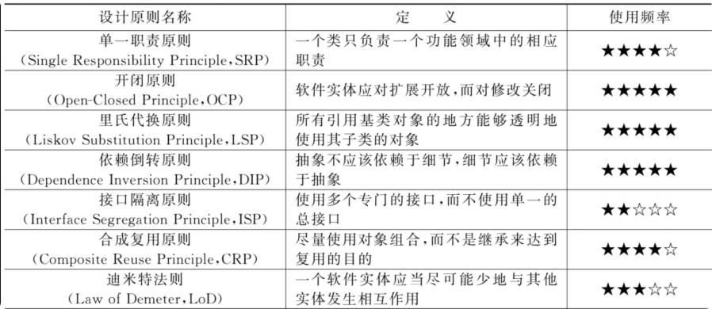

## 单一职责
一个类只负责一个功能领域中的相应职责：就一个类而言，应该只有一个引起它变化的原因。
是实现高内聚、低耦合的指导方针，最简单又最难运用的原则。

## 开闭原则
一个软件实体应当对扩展开放，对修改关闭。即软件实体应尽量在不修改原有代码的情况下进行扩展。   
需要对系统进行抽象化设计，抽象化是开闭原则的关键。在Java、C＃等编程语言中，可以为系统定义一个相对稳定的抽象层，而将不同的实现行为移至具体的实现层中完成。在很多面向对象编程语言中都提供了接口、抽象类等机制，可以通过它们定义系统的抽象层，再通过具体类来进行扩展。

## 里氏替换原则
所有引用基类（父类）的地方必须能透明地使用其子类的对象。   
里氏代换原则表明，在软件中将一个基类对象替换成它的子类对象，程序将不会产生任何错误和异常，反过来则不成立。如果一个软件实体使用的是一个子类对象，那么它不一定能够使用基类对象。例如，我喜欢动物，那我一定喜欢狗，因为狗是动物的子类；但是我喜欢狗，不能据此断定我喜欢动物，因为我并不喜欢老鼠，虽然它也是动物。   
里氏代换原则是实现开闭原则的重要方式之一。***由于使用基类对象的地方都可以使用子类对象，因此在程序中尽量使用基类类型来对对象进行定义，而在运行时再确定其子类类型，用子类对象来替换父类对象。***

## 依赖倒转原则
抽象不应该依赖于细节，细节应该依赖于抽象。换言之，要针对接口编程，而不是针对实现编程。   
依赖倒转原则要求在程序代码中传递参数时或在关联关系中，尽量引用层次高的抽象层类，即使用接口和抽象类进行变量类型声明、参数类型声明、方法返回类型声明，以及数据类型的转换等，而不要用具体类来做这些事情。为了确保该原则的应用，一个具体类应当只实现接口或抽象类中声明过的方法，而不要给出多余的方法，否则将无法调用到在子类中增加的新方法。   
在实现依赖倒转原则时，需要针对抽象层编程，而将具体类的对象通过依赖注入（Dependency Injection，DI）的方式注入其他对象中。依赖注入是指当一个对象要与其他对象发生依赖关系时，通过抽象来注入所依赖的对象。常用的注入方式有3种：构造注入、设值注入（Setter注入）和接口注入。构造注入是指通过构造函数来传入具体类的对象，设值注入是指通过Setter方法来传入具体类的对象，而接口注入是指通过实现在接口中声明的业务方法来传入具体类的对象。这些方法在定义时使用的是抽象类型，在运行时再传入具体类型的对象，由子类对象来覆盖父类对象。
依赖倒转原则是面向对象设计中很重要的原则，它表明了程序设计中should-have-been-done-by-the-base-class-but-was-done-by-the-derived-class-problem。   
