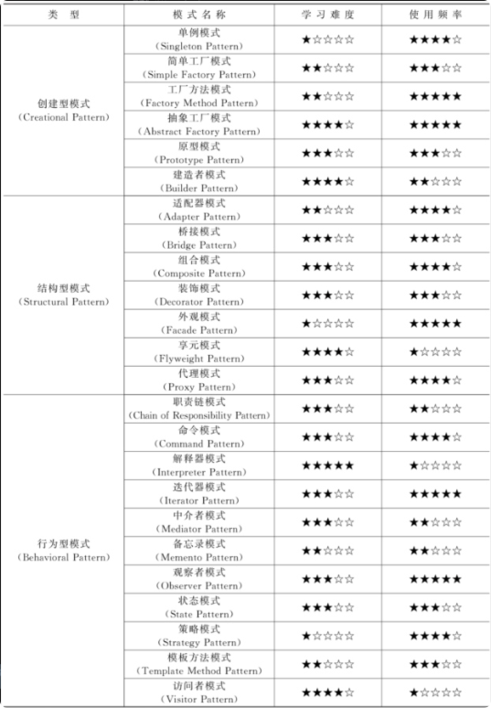

# design-pattern-in-python

## 什么是模式？
模式是在特定环境下人们解决某类重复出现问题的一套成功或有效的解决方案

1994年，四人组归纳发表了23种在软件开发中使用频率较高的设计模式，旨在用模式来统一沟通面向对象方法在分析、设计和实现间的鸿沟。

软件模式是指在软件开发过程中某些可重现问题的有效解决方法，其基础结构主要由四部分构成，包括问题描述（待解决的问题是什么）、前提条件（在何种环境或约束条件下使用）、解法（如何解决）和效果（有哪些优缺点）。

设计模式一般包含模式名称、问题、目的、解决方案、效果等组成要素，其中关键要素是模式名称、问题、解决方案和效果。

